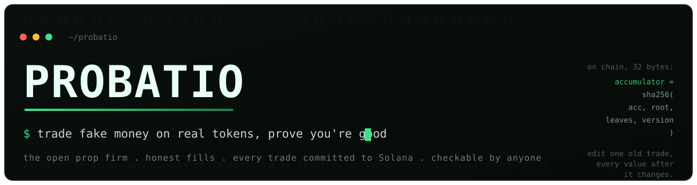

<div align="center">



<br/>

<a href="https://readme-typing-svg.demolab.com">
  
</a>

<br/><br/>


<br/>


</div>

<br/>

**An open prop firm.** A trading simulator on live Solana markets, with fills that
model real slippage and real delay, and every trade committed to the chain as it
is made, so a record cannot be edited afterwards.

The point is not the practice. It is that the result is checkable by anybody,
without trusting the site that produced it.

---

## The claim, and how to check it

Two claims, and each has a command rather than an argument.

### The fills are accurate

The engine is replayed against trades that actually happened: real swaps pulled
from the chain, each re-quoted from the reserves that stood immediately before
it, and compared against what the market produced.

```
RPC_VALIDATION=1 npx vitest run packages/validation/test/mainnet.test.ts
```

Most recent run, 221 events off mainnet:

| | |
|---|---|
| Scored pairs | 128 |
| Median error | **0 bps** |
| 95th percentile | **0 bps** |
| Worst case | **0 bps** |
| Exact matches | **128 of 128** |

Not close. Identical, to the lamport, on every sample.

A pair is only scored when the reserves prove the two trades were consecutive:
that nothing happened in between that we did not see. That run discarded 91 of
221 events for that reason. Throwing away most of the data is what makes the
number mean anything.

The harness reads live trades, so the sample differs every run and the error
does not.

### The records cannot be revised

Each fill is hashed into a fixed-width leaf carrying the pool reserves it was
quoted against, so a verifier needs nothing from us. Leaves are batched into a
merkle root, and roots are folded one at a time into a running value:

```
accumulator = sha256(accumulator ‖ root ‖ leaves ‖ engine_version)
```

Thirty-two bytes on chain covering every trade in order. Changing an old trade
changes every value after it, and those were already witnessed publicly at the
time.

The `/verify` page rebuilds every trade from its own recorded inputs, recomputes
each root, folds the chain, and compares against Solana, in the reader's browser,
against an endpoint they choose. It never asks this server whether the record is
valid, because a server vouching for its own records is worth nothing.

---

## Running it

Requires Node 22 or later. A Solana RPC endpoint is needed for anything that
touches the chain; the public cluster works for trying it out and rate-limits
hard.

```bash
npm install
cp app/.env.example app/.env.local     # then fill in SESSION_SECRET
npm test                                # 1290 tests, no network
npm --prefix app run dev
```

The Anchor program is separate and needs the Solana toolchain:

```bash
cd program && cargo test               # runs under litesvm
```

Note that `cargo build` does **not** rebuild the binary the tests load. Use
`cargo build-sbf`, or the tests run against a stale program.

---

## Architecture

An npm workspace of 22 TypeScript packages plus an Anchor program. Most packages
are pure (no clock, no network, no database), which is why the whole suite runs
offline in about ten seconds. The ones that reach outside are marked, and they
are the only ones that can.

| Package | Responsibility | Reaches out |
|---|---|---|
| `sim` | Fixed-point arithmetic and the fill engine | |
| `trading` | Applying fills to balances and positions | |
| `pools` | Venue decoding and the only RPC client | network |
| `candles` | Prices and chart series from pool reserves | network |
| `metadata` | Token names, on-chain and off, with the untrusted half fenced off | network |
| `feed` | The live launch websocket | network |
| `commit` | Leaf encoding, merkle trees, the accumulator chain | |
| `keeper` | Batching and committing, reconcilable after a crash | network, database |
| `validation` | The accuracy harness above | network |
| `analytics` | What a trade log says about the trader | |
| `coach` | Turning that into advice without letting a model invent a number | network |
| `seasons` | Rulesets, their hash, lifecycle and payout maths | |
| `scoring` | Ranking, the results commitment, and the verifiable finalization | |
| `payments` | Solana transactions, built and verified by hand | |
| `sybil` | Making a track record expensive to fake | network |
| `profile` | Display names and the rules against impersonation | |
| `limits` | Rate limiting | |
| `health` | What is working, and how long it has not been | |
| `retention` | Whether people come back | |
| `auth` | Sign-in with Solana, and sessions. No email anywhere | |
| `db` | Schema, migrations, and every query | database |

Plus `app` (Next.js 16) and `program` (Anchor).

Amounts are integers everywhere: `bigint` in TypeScript, fixed-point on chain.
Nothing in this repository stores money in a float.

---

## Documentation

The [docs](docs/) directory is written for whoever operates this, and the
reasoning is in it rather than in commit messages.

- [Void policy](docs/void-policy.md): when a season does not count, decided in
  advance and measured rather than judged
- [Program review](docs/program-review.md): findings, criticals, and what is
  still open
- [Upgrade authority](docs/upgrade-authority.md): why "unfakeable" is a weaker
  claim than it sounds, and what would make it stronger
- [Keeper key](docs/keeper-key.md): the blast radius of the one hot key
- [Downtime](docs/downtime.md): what degrades, and the one thing that never does
- [Backups](docs/backup-and-restore.md): including the drill and the two bugs it
  found
- [Load](docs/load.md), [rate limits](docs/rate-limits.md),
  [fee treasury](docs/fee-treasury.md), [analytics](docs/analytics.md)

The user-facing explanations live at `/docs` on the site.

---

## Status

Not deployed. The program has never been on mainnet, and until it is, every claim
about what it does is a claim about source code.

Two of the gaps that used to be listed here are closed:

- **The chain gateway is real.** `SolanaGateway` builds, signs and sends the
  commit transactions by hand, and a drill against a local validator confirms the
  accumulator on chain matches the one computed locally, byte for byte.
- **Refunds exist.** `void_season` and `refund_entry` mean a voided season can
  give every entrant back exactly what they paid, which is what the void policy
  always promised.

The payout path is in progress:

- **The finalization is provable.** A season's ending is now a document that
  recomputes rather than an assertion: `@probatio/scoring` derives the ranking,
  the split, the results root and a proof per winner from the raw standings, and
  `verifyFinalization` re-derives the whole thing and rejects a tampered payout,
  a swapped winner, a wrong ruleset or a tampered root. This is the part that is
  uniquely ours; the on-chain claim is a well-trodden pattern.
- **Nothing pays a winner yet.** Entry is free, and a paid season is refused
  rather than opened, because the finalization is not yet wired to a real closed
  season, the vault is not funded on chain, and no route serves the proof a claim
  needs. `chargeRefusal` in `@probatio/seasons` is consulted both where the entry
  button is drawn and where the money would be taken.

What remains is deployment itself, and the upgrade authority: while it is held,
the program can be replaced, so read [what you still have to
trust](docs/upgrade-authority.md) before believing anything above.

See [the launch sequence](docs/launch-sequence.md) for the order these have to
happen in and why.

---

## Licence

[AGPL-3.0](LICENSE). If you run a modified version as a service, the source of
your version has to be available too, which is the point, for a product whose
argument is that it can be checked.
